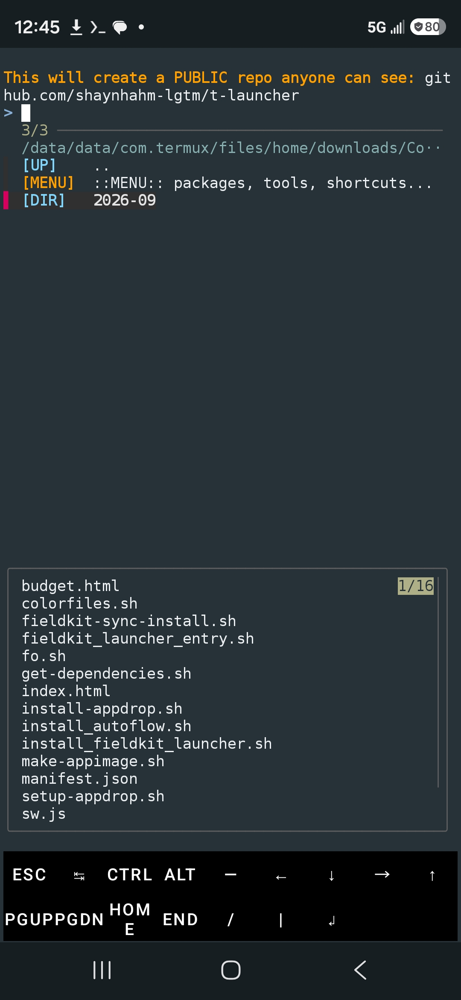
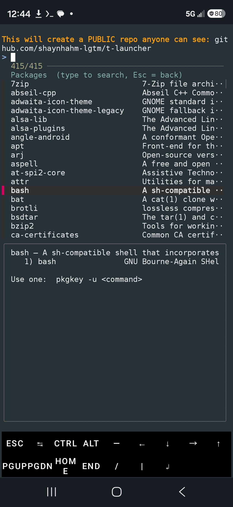
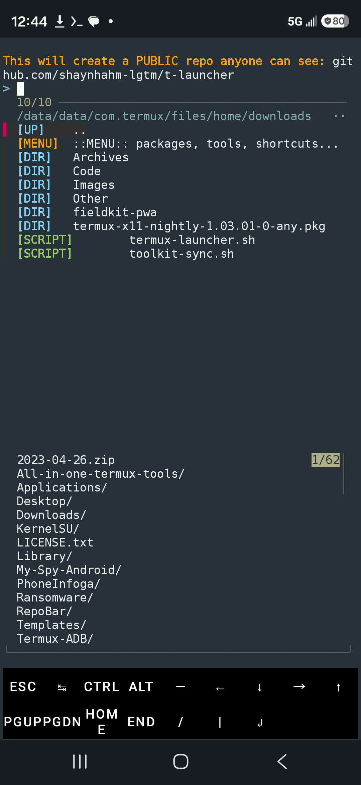

# t-launcher

**A color-coded file browser and command finder for Termux.**
Browse your files, see what anything is, and run it, all from one fuzzy-search menu.
Comes with **pkgkey** (what can my installed packages do?) and **fkey** (what is this file and how do I use it?).

   

## Install

```
curl -fsSL https://raw.githubusercontent.com/shaynhahm-lgtm/t-launcher/main/install.sh | bash
```

Then type `t-launcher`. Needs only `fzf`, which the installer adds for you.

## What it does

- **Color-coded listing**: folders, scripts, executables, archives, packages, web pages, and text files each get their own color. Folders are listed first.
- **Live preview**: see inside a file or folder before opening it (Ctrl+P toggles it).
- **Smart actions**: select a file and the best action is starred at the top: run a `.py`, extract a `.tar.gz`, open an `.html` in your browser. `chmod +x` is handled for you.
- **fkey built in**: "Commands for this file" lists the right commands for that file type with your filename already filled in. Pick one, tweak it, run it.
- **pkgkey built in**: search every installed package, preview the commands it gives you, then run, read help, or open the man page.
- **Install any script as a command**: turn a script into something you can type from anywhere.
- **No dead ends**: Esc goes back one step like a browser, and `..` always goes up.
- **Handy shortcuts**: jump to Downloads or home, toggle hidden files, or open the folder in yazi, mc, ranger, or nnn.

## The tools on their own

```
pkgkey               list installed packages
pkgkey <package>     show its commands, then run / help / man them
pkgkey -s <term>     search packages
pkgkey -c <command>  which package a command came from
pkgkey -o            export everything to a Markdown file

fkey <ext|file>      what a file type is and how to work with it
fkey -l              list all known file types
```

## Uninstall

```
curl -fsSL https://raw.githubusercontent.com/shaynhahm-lgtm/t-launcher/main/install.sh | bash -s -- --uninstall
```

## License

MIT
